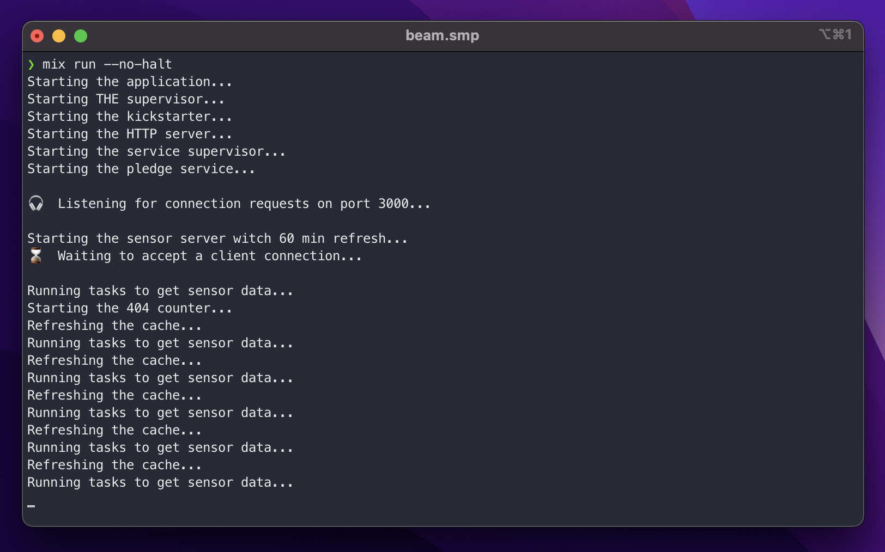
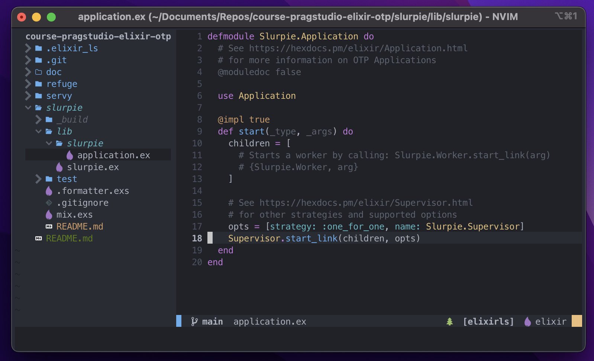

# course-pragstudio-elixir-otp

This repository is the code corresponding to the [The Pragmatic Studio: Elixir & OTP](https://pragmaticstudio.com/courses/elixir) lab by Mike and Nicole Clark.

> There are many apps in this repository.

## Apps

### [Refuge](refuge/README.md)

> The initial app with phoenix framework.

### [Servy](servy/README.md)

> The app with all the exercises and practices.

### [Slurpie](slurpie/README.md)

> The initial app with supervisor configuration.

