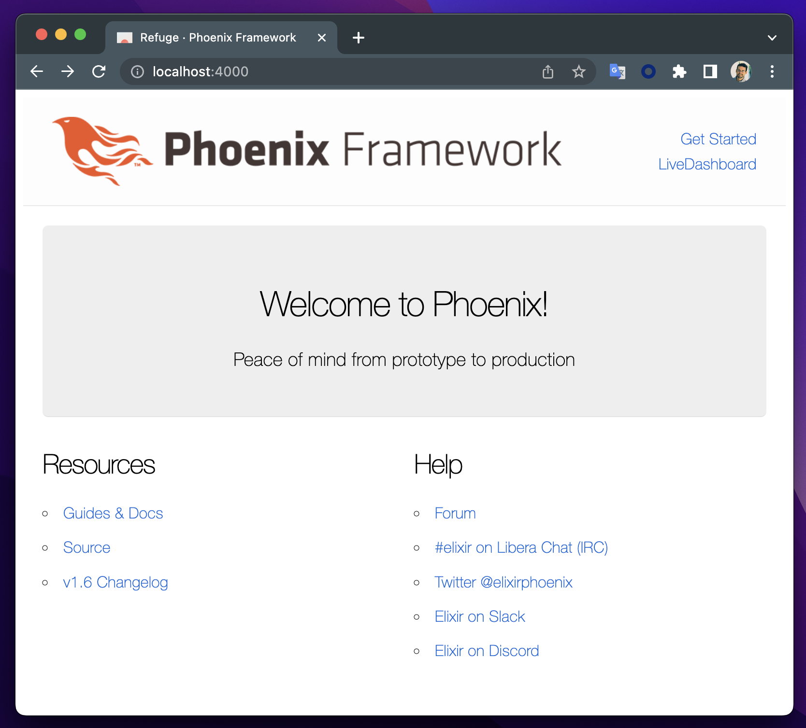

# course-pragstudio-elixir-otp

This repository is the code corresponding to the [The Pragmatic Studio: Elixir & OTP](https://pragmaticstudio.com/courses/elixir) lab.

> There are many apps in this repository.

## Apps

### Refuge

> The initial app with phoenix framework

[:link: More details](refuge/README.md)

### Servy

> The app with all the exercises and practices

[:link: More details](servy/README.md)

### Slurpie

> The initial app with supervisor configuration

[:link: More details](slurpie/README.md)
